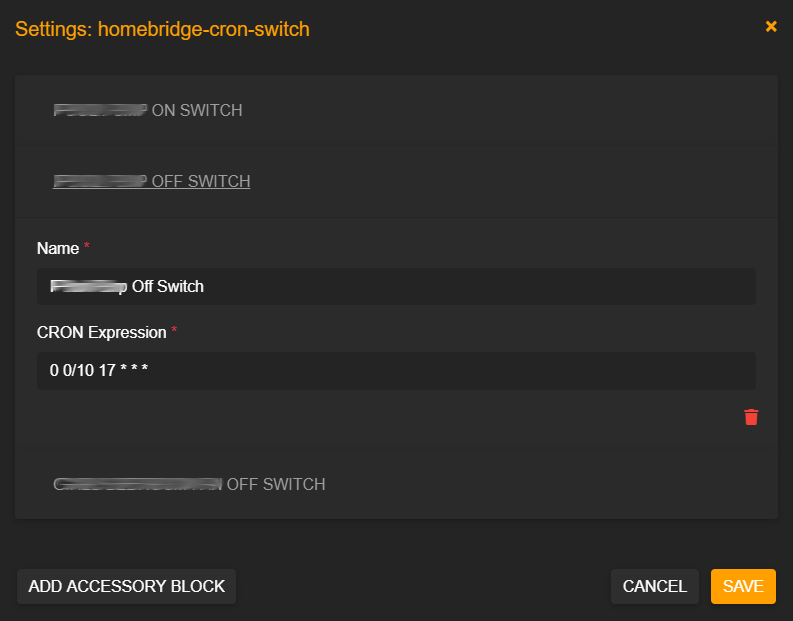

### Homebridge CRON Switch

A [homebridge](https://github.com/nfarina/homebridge) plugin that exposes to Homekit a switch that is momentarily turned on using a schedule derived from a CRON job expression.

## Configration

Configuration can be done using [Homebridge Config UI X](https://github.com/oznu/homebridge-config-ui-x).



## Sample Configuration

```yaml
"accessories": [
    {
      "accessory": "CronSwitch",
      "name": "Turn Something On Every 5 Seconds Switch",
      "cron": "0/5 * * * * *"
    }   
]
```
### Configuration Definition

* **accessory**: The identifier for the accessory (*CronSwitch*).
* **name**: The name of the switch exposed.
* **cron**: The cron expression.